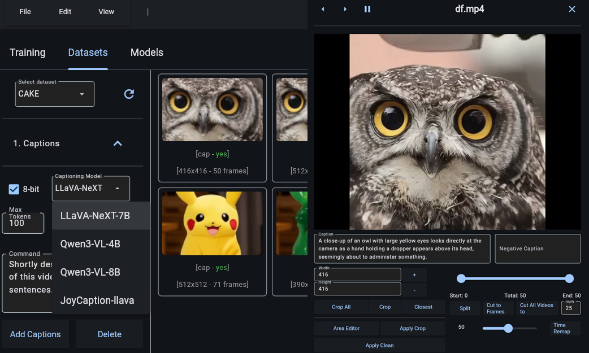

# Diffusion-pipe Wizard GUI (WIP)

A Flet-based GUI application designed to run on WSL/Linux for constructing and managing configuration files for [diffusion-pipe](https://github.com/tdrussell/diffusion-pipe).

Key Features:
- Interactive user interface that automatically matches and displays default model configurations, making it easy to customize and fine-tune training parameters for supported models without manual editing of configuration files
- Built-in video/image editing and captioning manager for dataset preparation
- Model download manager using aria2c for efficient parallel downloading of large model files

**Note:** This application was tested on WSL (Windows Subsystem for Linux) and may require additional testing on native Linux distributions.
**Note:** Not all functions are implemented to properly work with dataset files on server yet.



## Quick Start
📁 Navigate to project folder (optional)

```
cd Dpipe
```
🚀 Run flet_app

```
source ~/miniconda3/bin/activate && source $(conda info --base)/etc/profile.d/conda.sh && conda activate ./dp_env && python3 -m flet_app.flet_app
```


# 1. Installation

### 1.1 🔧 Install FFMPEG ,aria2 and Miniconda

```
sudo apt update && sudo apt install ffmpeg && sudo apt install -y aria2

wget https://repo.anaconda.com/miniconda/Miniconda3-latest-Linux-x86_64.sh
chmod +x Miniconda3-latest-Linux-x86_64.sh
./Miniconda3-latest-Linux-x86_64.sh -b -p ~/miniconda3
source ~/miniconda3/bin/activate
```

### 1.2 📥 Clone GUI and diffusion-pipe

```
git clone https://github.com/siraxe/Dpipe-Wizard-GUI.git Dpipe
cd Dpipe
git clone --recurse-submodules https://github.com/tdrussell/diffusion-pipe
```

### 1.3 🐍 Setup venv

```
conda env create -f dp_env.yml -p ./dp_env
```

## 🔧 Apply Optional Patches

A unified patch manager script is available to apply patches to diffusion-pipe:

```bash
# Make script executable
chmod +x patch_diffpipe.sh

# Interactive mode - choose which patches to apply
./patch_diffpipe.sh

# Or apply specific patches
./patch_diffpipe.sh --patch batch      # Batch size fix
./patch_diffpipe.sh --patch longcat    # LongCat-Video model
./patch_diffpipe.sh --patch qwen       # Qwen Plus model

# Apply all patches at once
./patch_diffpipe.sh --all

# Preview changes without applying
./patch_diffpipe.sh --dry-run

# List available patches
./patch_diffpipe.sh --list

# Rollback to previous state
./patch_diffpipe.sh --rollback
```

### Available Patches

**1. Batch Size Change Fix** (`batch`)
- Resume training with different batch sizes without crashes
- Auto-detects batch size changes and recovers gracefully
- Works with old checkpoints
- **NEW**: Automatically applies learning rate from config file on resume

**2. LongCat-Video Model** (`longcat`)
- Thanks to https://github.com/tdrussell/diffusion-pipe/pull/453
- Support for LongCat-Video model training
- Auto-initializes submodules

**3. Qwen Plus Model** (`qwen`)
- Enhanced Qwen image model support
- Additional dataset and tool improvements

For detailed information, see:
```bash
cat flet_app/modules/batch_patch/README.md
```

### Running the GUI

After applying patches (or skip if not needed):

```bash
conda activate ./dp_env && python3 -m flet_app.flet_app
```

# 2. 🖥️ Setup WSL to be able to trigger photoshop (optional)
Edit /etc/wsl.conf in wsl

```
sudo nano /etc/wsl.conf
```
Ensure:

```
[interop]
enabled=true
appendWindowsPath=true

[automount]
enabled=true
options = "metadata,umask=22,fmask=11,case=off"
```
In Windows PowerShell : wsl --shutdown

Reopen WSL and re-test


# ⚙️ Edit start_dpipe.bat


```
# Change this to match your setup ,to use it from windows
/home/username/Dpipe
```
