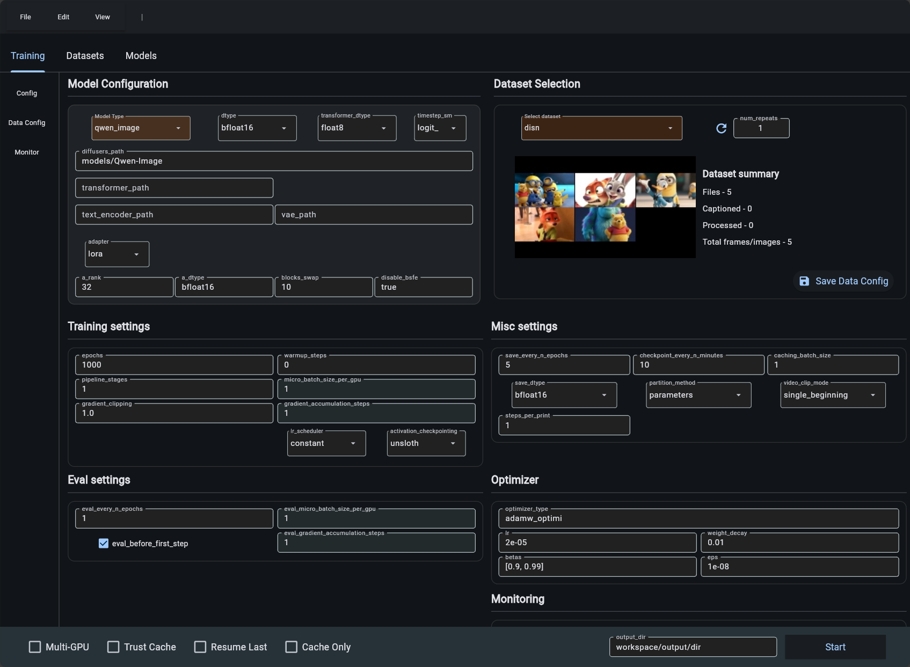

# Diffusion-pipe Wizard GUI (WIP)

A Flet-based GUI application designed to run on WSL/Linux for constructing and managing configuration files for [diffusion-pipe](https://github.com/tdrussell/diffusion-pipe).

# 1. Installation

### 1.1 🔧 Install FFMPEG ,aria2 and Miniconda

```
sudo apt update && sudo apt install ffmpeg && sudo apt install -y aria2

wget https://repo.anaconda.com/miniconda/Miniconda3-latest-Linux-x86_64.sh
chmod +x Miniconda3-latest-Linux-x86_64.sh
./Miniconda3-latest-Linux-x86_64.sh -b -p ~/miniconda3
source ~/miniconda3/bin/activate
```

### 1.2 📥 Clone and Setup venv

```
git clone --recurse-submodules https://github.com/siraxe/diffusion-pipe-Wizard-GUI.git Dpipe
cd Dpipe
conda env create -f dp_env.yml -p ./dp_env
```

### 🚀 Run flet_app

```
conda activate ./dp_env && python3 -m flet_app.flet_app

or

source ~/miniconda3/bin/activate && source $(conda info --base)/etc/profile.d/conda.sh && conda activate ./dp_env && python3 -m flet_app.flet_app
```


**Note:** This application was tested on WSL (Windows Subsystem for Linux) and may require additional testing on native Linux distributions.

**Note:** Not all functions are implemented to properly work with dataset files on server yet.




Key Features:
- Interactive user interface that automatically matches and displays default model configurations, making it easy to customize and fine-tune training parameters for supported models without manual editing of configuration files
- Built-in video/image editing and captioning manager for dataset preparation
- Model download manager using aria2c for efficient parallel downloading of large model files

## 🔧 Apply Optional Patch

Apply patch to diffusion-pipe submodule:

```bash
# Make script executable
chmod +x apply_patch.sh

# Apply 
./apply_patch.sh
```

**Patches are applied from `patch/` directory to `diffusion-trainers/diffusion-pipe`**


# 🖥️ Setup WSL to be able to trigger photoshop (optional)
Edit /etc/wsl.conf in wsl

```
sudo nano /etc/wsl.conf
```
Ensure:

```
[interop]
enabled=true
appendWindowsPath=true

[automount]
enabled=true
options = "metadata,umask=22,fmask=11,case=off"
```
In Windows PowerShell : wsl --shutdown

Reopen WSL and re-test


# ⚙️ Edit start_dpipe.bat


```
# Change this to match your setup ,to use it from windows
/home/username/Dpipe
```
